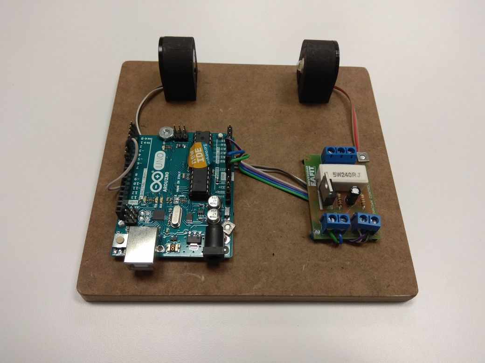

# Laboratorio del Control de Iluminación de un Sistema Realimentado

## Objetivo General

En este laboratorio se desarrollará el modelo experimental y el control de un sistema de iluminación.

### Tareas

Para cumplir el objetivo del laboratorio se necesita realizar las siguientes tareas.

1. Subir el código **Arduino** `_control_iluminacion` a la maqueta.
2. Tomar los datos con ayuda del archivo `_simulink_lazo_abierto`. 
3. Realizar un acondicionamiento de los datos tomados.
4. Identificar la función de transferencia del sistema, utilizando la applicación de **Matlab** llamada _System Identification_.
5. Encontrar los valores optimos para el controlador, utilizando la applicación de **Matlab** llamada _PID Tuner_.
6. Verificar el correcto funcionamiento del control con ayuda del archivo `_simulink_lazo_cerrado`.

## Descripción de la planta

La planta es un sistema de iluminación con un LED de potencia (actuador) y un LDR (_Light Dependent Resistor_, sensor). Este sistema es controlado a traves de un **Arduino**. A continuación se presenta una imagen del sistema:

## Ejecución

Para desarrollar este laboratorio seguiremos cada una de las tareas de forma secuencial.

### 1. Subir el código **Arduino**

Empecemos subiendo el código **Arduino** a la maqueta. Este código basicamente lee la información del sensor y la envia por puerto serial al computador, esta información esta codificada en código `ASCII`. Adicionalmente si uno envia un valor (`0-255`) por el puerto serial al **Arduino**, este cambiará la intensidad del LED proporcionalmente a este valor. Para entender mejor el programa veamos el código `_control_iluminacion`. 

> Una vez subido el código al **Arduino** se puede verificar via el Monitor Serie la recepción de caracteres `ASCII`, enviando cualquier caracter, el caracter recibido debería cambiar.

### 2. Toma de datos
