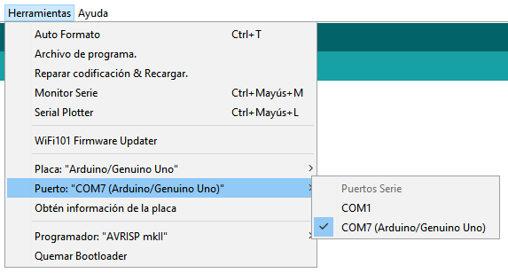
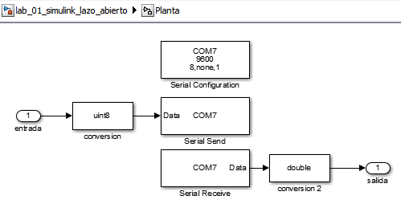
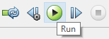
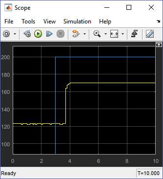
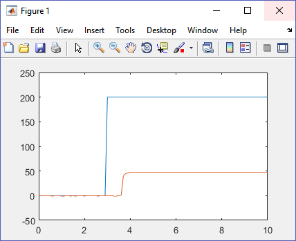
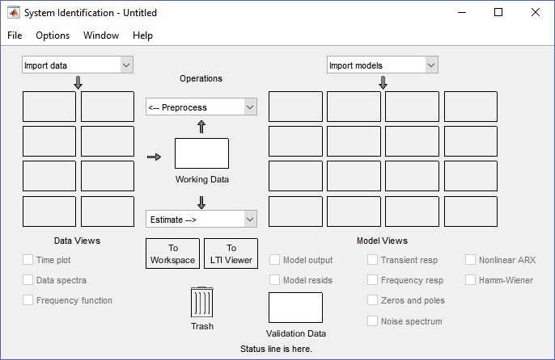
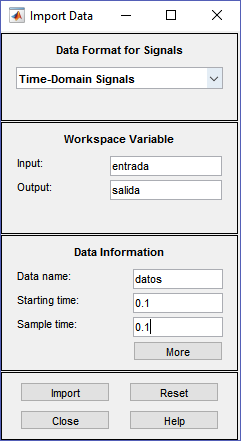
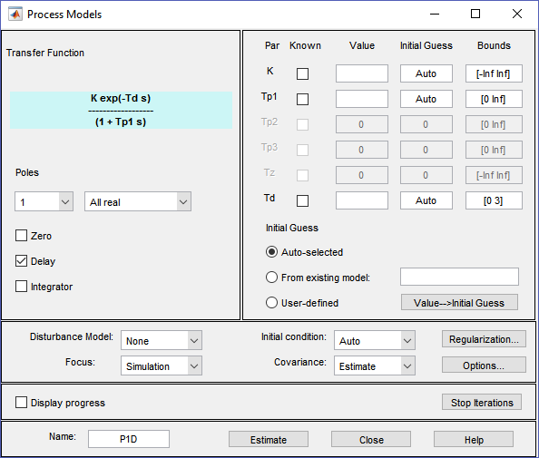
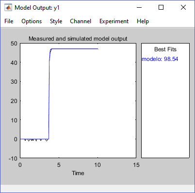
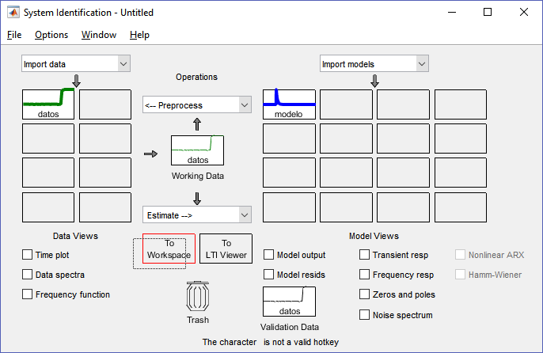

# Laboratorio del Control de Iluminación de un Sistema Realimentado

## Objetivo General

En este laboratorio se desarrollará el modelo experimental y el control de un sistema de iluminación.

> Los archivos para la practica pueden ser encontrados en [github](https://github.com/davinsony/control-mecatronico/tree/master/lab_control_iluminacion/code)

### Tareas

Para cumplir el objetivo del laboratorio se necesita realizar las siguientes tareas.

1. Subir el código **Arduino** `control_iluminacion` a la maqueta.
2. Tomar los datos con ayuda del archivo `simulink_lazo_abierto`. 
3. Realizar un acondicionamiento de los datos tomados.
4. Identificar la función de transferencia del sistema, utilizando la applicación de **Matlab** llamada _System Identification_.
5. Encontrar los valores optimos para el controlador, utilizando la applicación de **Matlab** llamada _PID Tuner_.
6. Verificar el correcto funcionamiento del control con ayuda del archivo `simulink_lazo_cerrado`.

## Descripción de la planta

*[LED]: Light Emitter Diode

*[LDR]: Light Dependent Resistor

La planta es un sistema de iluminación con un LED de potencia (actuador) y un LDR (sensor). Este sistema es controlado a traves de un **Arduino UNO**. A continuación se presenta una imagen del sistema:


## Ejecución

Para desarrollar este laboratorio seguiremos cada una de las tareas de forma secuencial.

### 1. Subir el Código **Arduino**

*[IDE]: Integrated Development Environment

Abramos el archivo `control_iluminacion` en el **Arduino IDE**. Para ubicar el puerto de comunicación serial vamos al menú `Herramientas` `>` `Puerto`. Selecionamos el puerto donde se encuentre el **Arduino UNO**.



Luego, subimos el código al **Arduino UNO**.


*[ASCII]: American Standard Code for Information Interchange

Este código basicamente lee la información del sensor y la envia por puerto serial al computador, esta información esta codificada en código `ASCII`. Adicionalmente si uno envia un valor (`0-255`) por el puerto serial al **Arduino**, este cambiará la intensidad del LED proporcionalmente a este valor.  

> Una vez subido el código al **Arduino** se puede verificar via el Monitor Serie la recepción de caracteres `ASCII`, enviando cualquier caracter, el caracter recibido debería cambiar.

### 2. Toma de Datos

Para la toma de datos usaremos el archivo `simulink_lazo_abierto`. Este archivo debe ser configurado con el puerto de comunicación `COM-` en el cual aparece el **Arduino UNO** conectado al computador. Normalmente es el mismo puerto que usamos en el paso anterior.

Una vez abierto el archivo en **simulink**, haremos doble-clic en planta para acceder a los bloques internos. Como se ve en la figura, hay tres bloques que deben ser configurados de acuerdo al puerto serial del **Arduino**.



Habiendo configurado el puerto, ejecutamos el programa, la información enviada por el **Arduino** puede ser visualizada en el `scope` del programa en **simulink**.



La ejecucción del programa, genera la variable `data` en el workspace de **Matlab**. Utilizando el comando `plot(data)` podemos visualizarla.



### 3. Condicionamiento de Datos

Antes de indentificar la función de transferencia del sistema, debemos realizar un condicionamiento de los datos. Para esto vamos a extraer los vectores `tiempo`, `entrada` y `salida` de la variable `data`. La extracción la haremos ejecutando en **Matlab** los siguientes comandos.

```matlab
tiempo  = data.time;
entrada = data.Data(:,2);
salida  = data.Data(:,1);
```

Podemos verificar que hemos extraido correctamente los datos usando el comando `plot(tiempo,entrada,tiempo,salida)`.

Como se puede observar la salida tiene un _off-set_, que debe ser eliminado para la correcta indentificación del modelo. Una forma de eliminar este _off-set_ puede ser simplemente eliminando el valor inicial de la señal de salida a todo el vector. `salida = salida - salida(1)`. Despues de este proceso, las señales quedan como se muestra a continuación. 



### 4. Identificación del Sistema

Para la indetificación se usará la aplicación de **Matlab**: _System Identification_.



Lo primero que se debe hacer es importar los datos, para esto usaremos el menú desplegable `import data` y en este seleccionamos `Time domain data...` 



Aquí, escribiremos el nombre de las variables `entrada` en **Input** y `salida` en **Output**. Igualmente, tenemos que ingresar la información del tiempo _Starting time_ que puede ser `0` y el _Sample time_ que es el tiempo de muestreo (usando `tiempo(2)-tiempo(1)` podemos obtener este valor). Finalmente presionamos `import`.

Luego de la importación, haremos la identificación, para esto vamos al menú desplegable `Estimate` y selecionamos `Process models...`



En esta ventana solo necesitamos presionar `Estimate`, y cerramos esta ventana. En la ventana principal, podemos verificar si el modelo representa bien la realidad seleccionando `model output`, esta acción abrirá una ventana donde podemos ver el ajuste.



Cuando tengamos un modelo satisfactorio. Podemos arrastrar el modelo al _workspace_.



### 5. Diseño del Controlador
